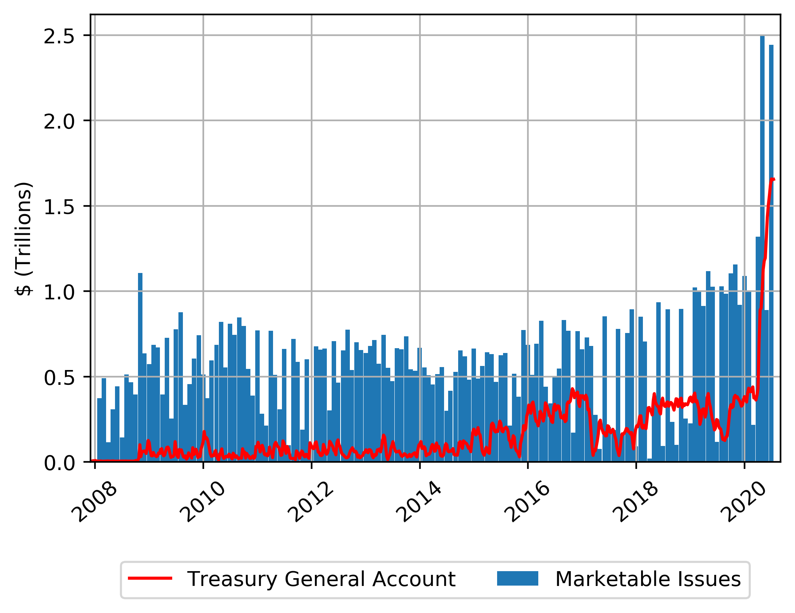

# US-treasury-issuance

Reads daily treasury statement txt files from the <a href='https://fsapps.fiscal.treasury.gov/dts/issues'>Bureau of the Fiscal Service</a>, and extracts the total new US Treasury bond issues. Comparison of all new marketable bond issues (consisting of bills, notes, bonds and TIPS). 

In the graph below, new marketable issues are plotted next to the level of the US Treasury General Account which is currently at levels magnitutes higher than the years before. This might indicate that the US government still has a lot of money to spend as corona stimulus (maybe in the order of magnitude of $1-1.5T)

